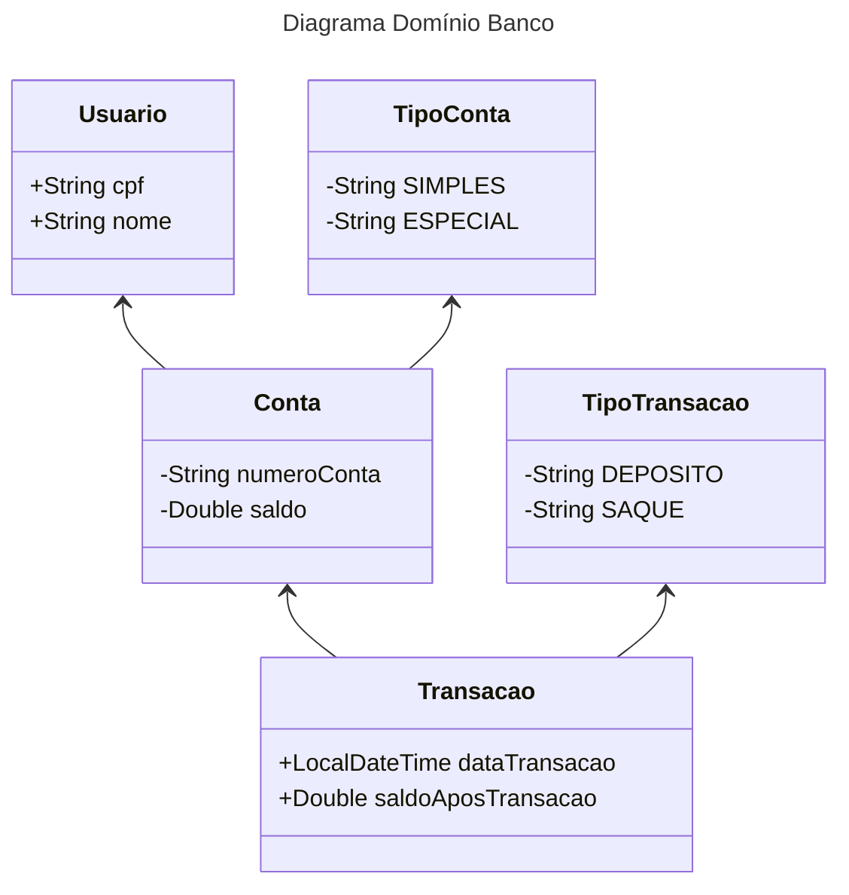

# Descrição do Sistema — Conta Bancária

O sistema de **Conta Bancária** tem como objetivo gerenciar operações de saques e depósitos, armazenando todas as movimentações associadas a cada conta, junto com a data e hora de cada transação.

---
O diagrama abaixo descreve o relacionamento entre cada entidade do desafio proposto.

## 📌 Funcionalidades Principais

### 1. Registro de Transações
- Todas as operações de saque e depósito devem ser registradas no sistema.
- Cada registro de transação deve conter:
    - **Tipo de operação:** saque ou depósito;
    - **Valor da operação**;
    - **Data e hora exata** da realização;
    - **Identificação da conta** e do **usuário associado**.

---

### 2. Exibição do Extrato
Ao consultar o extrato de uma conta, o sistema deve exibir:
- **Nome do usuário**;
- **Número da conta**;
- **Lista de movimentações** (saques e depósitos), **ordenadas por data e hora em ordem decrescente**.

Cada movimentação exibida deve incluir:
- Tipo de transação (saque ou depósito);
- Valor;
- Data e hora.

---

### 3. Armazenamento de Dados
- Todos os cadastros devem ser salvos em **arquivos identificados pelo CPF** do usuário.

**Estrutura de arquivos:**
- **Cadastro do usuário:** informações pessoais (nome, CPF, etc.);
- **Cadastro da conta:** número da conta, saldo atual, limite (se aplicável);
- **Cadastro das transações:** lista de todas as movimentações realizadas.

> Os registros devem ser **persistidos de forma assíncrona** no banco de dados, para evitar bloqueios na execução do sistema.

---

### 4. Tolerância a Falhas
As buscas por registros devem retornar de forma opcional, permitindo que o sistema continue funcionando mesmo que:
- Um arquivo não seja encontrado;
- Não existam transações para exibir;
- Não exista conta cadastrada para determinado CPF.

> O sistema deve tratar essas situações **sem gerar erros** que interrompam a execução.

---

## 🔄 Fluxo Básico de Uso
1. O usuário é cadastrado (**arquivo:** `usuario_<CPF>.txt` ou equivalente no banco de dados).
2. A conta bancária é associada ao usuário (**arquivo:** `conta_<CPF>.txt`).
3. Ao realizar **saques ou depósitos**:
    - A transação é registrada no arquivo de transações (`transacoes_<CPF>.txt`);
    - A operação é gravada **assíncronamente** no banco de dados.
4. Ao consultar o extrato:
    - O sistema busca os dados do usuário e da conta;
    - As transações são listadas por data/hora decrescente.

---
